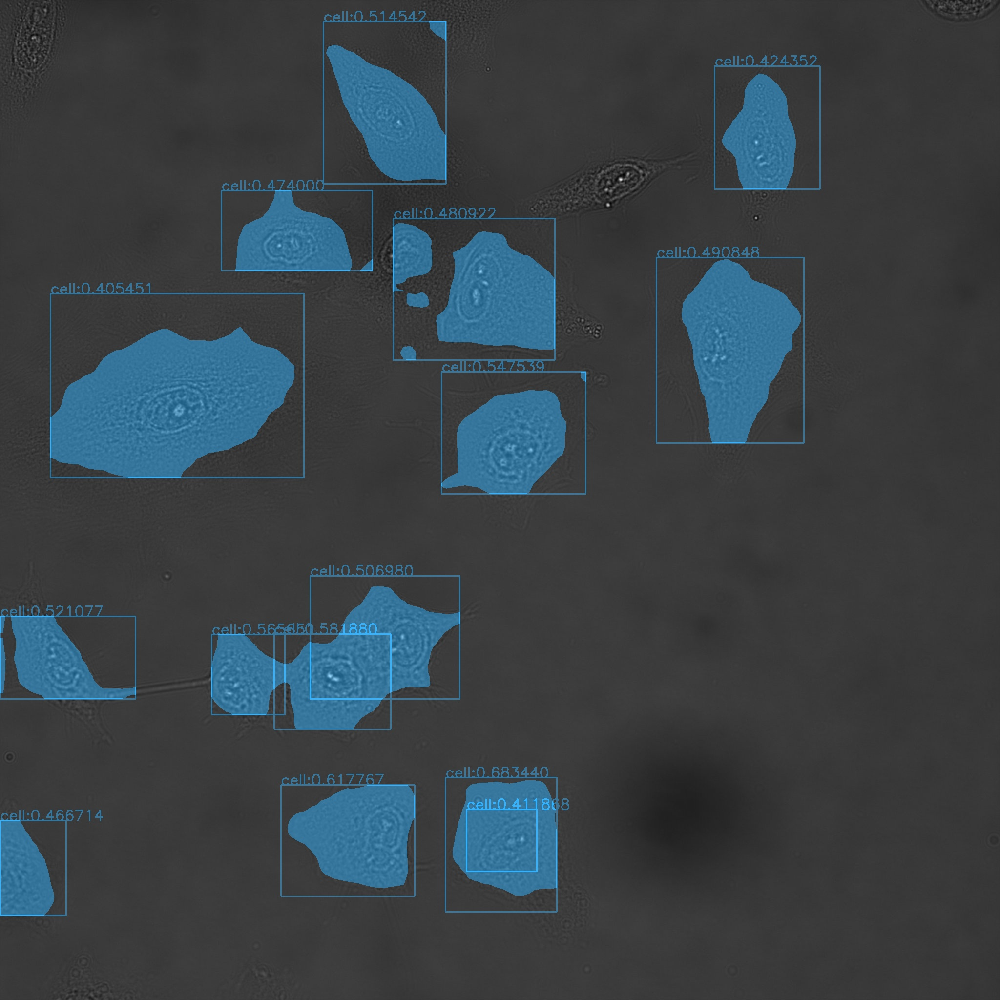
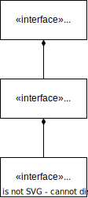

# imageC

ImageC is a high performance image analysis tool designed to analyse microscopy images in the biological sciences.
With the help of pipelines images can be analyzed via batch processing.

## Features

- Reads tiff and big tiff images.
- Multi channel batch analysis of images with up to 12 different channels per image.
- Can interpret the [OME-XML](https://docs.openmicroscopy.org/ome-model/5.6.3/ome-xml/) description stored in the image.
- AI based ROI (region of interest) detection.
- Supporting following channel types: `EV`, `CELL`, `NUCLEUS`, `TETRASPECK BEAD`.
- Automatic CSV report generation.
- Single vesicle/cell/nucleus analysis and detailed reporting.

### Supported pipelines

#### Counting

Allows to count `EVs`, `CELLs` and `NUCLEI` in the different channels of an image.
Single particle analysis is done and data are stored as detailed and summery in CSV report files.

#### Colocalization

**Planned**
Calculate the colocalization of EVs in multiple channels and store the results to a CSV report.

#### In cell counting

**Planned**
Counts the number of EVs found within a cell area and calculates the colocalization.

## Example pictures

*cell segmentation*

## Class diagram

## Todo

- [ ] Ignore result folder

## Debugging

 valgrind --tool=massif --log-file="filename" ./build/build/tests "[pipeline_test_spots]"

## Build

`docker build --target run -t joda001/imagec:latest .`

`docker run -p 7367:7367 -v /home:/home joda001/imagec`
# MSYS

pacman -S mingw-w64-x86_64-catch
pacman -S mingw-w64-x86_64-pugixml
pacman -S mingw-w64-x86_64-opencv
pacman -S mingw-w64-x86_64-nlohmann-json
pacman -S mingw-w64-x86_64-libtiff
