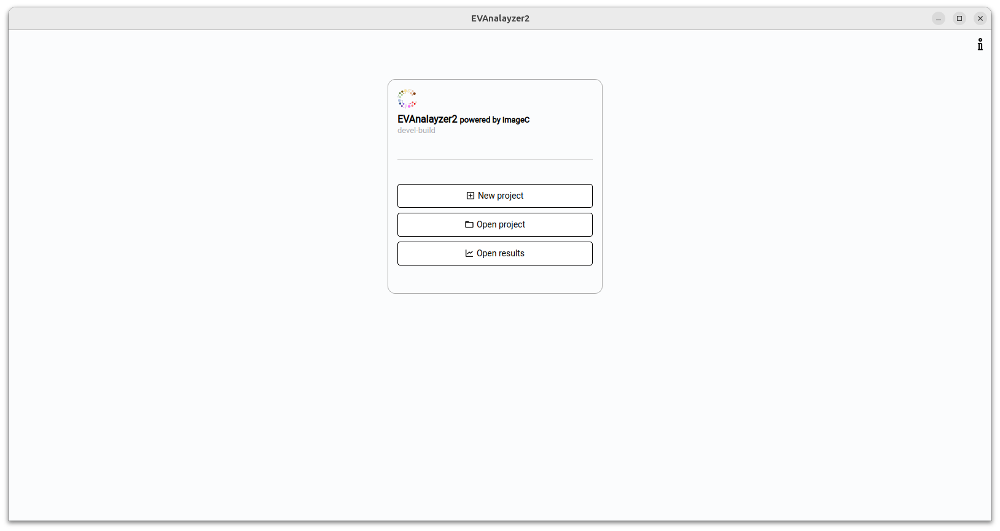
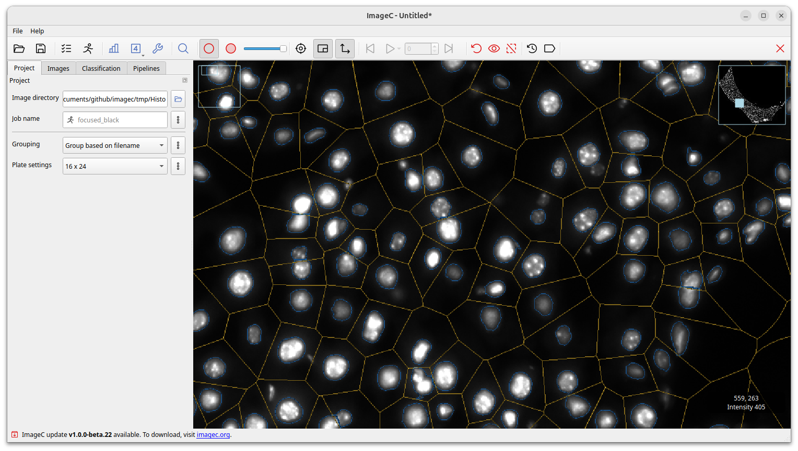
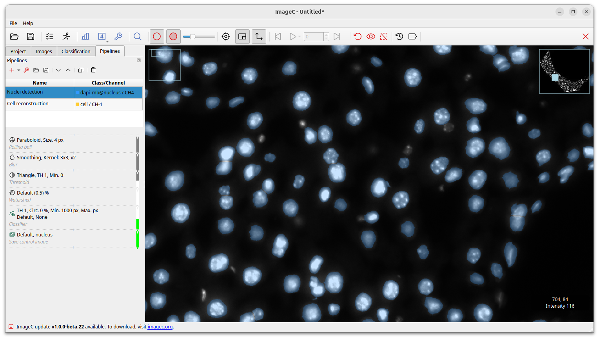
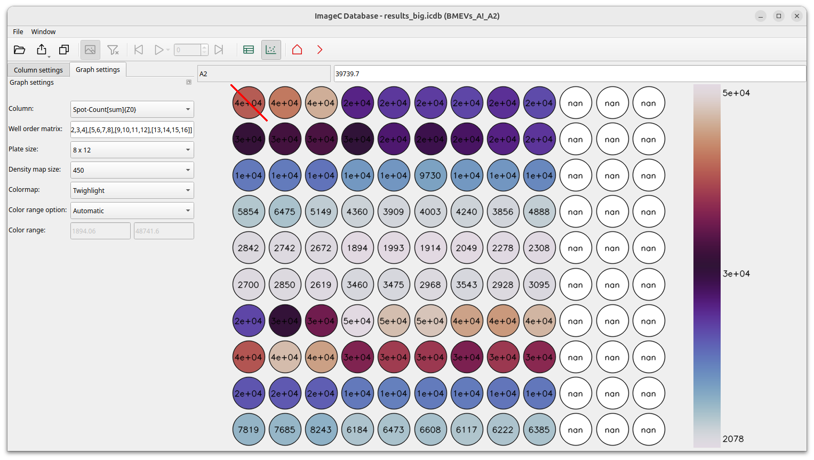
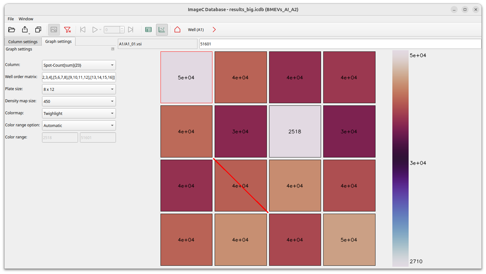
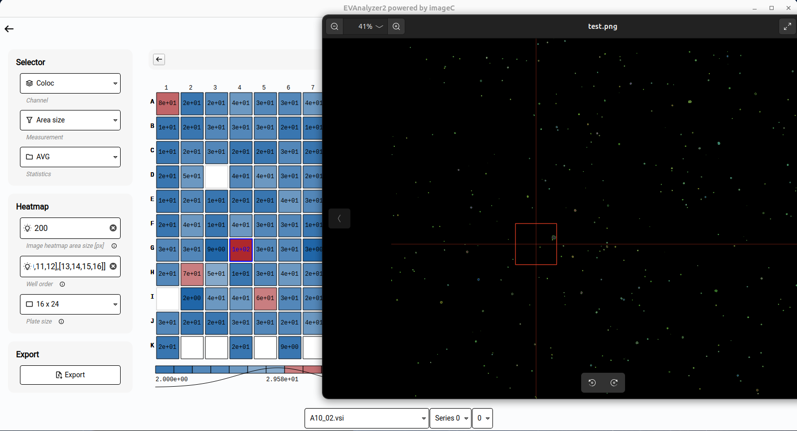

[](https://github.com/joda01/imagec/actions/workflows/cmake-multi-platform.yml)


# imageC (EVAnalyzer 2)

is an open source application designed for high throughput analyzing of microscopy images in the biological sciences.  

With imageC image processing pipelines can be defined which are applied on a set of images to analyze.
The resulting data is stored in a file-based database (duckdb) and can either be viewed directly in imageC using the built-in reporting tool, or the data can be exported to other file formats.  

imageC (EVAnalayzer 2), the direct successor of [EVAnalayzer](https://github.com/joda01/evanalyzer) an imageJ plugin with more than 3000 downloads (June 2024), is a standalone application written in C++.
The main goals were to improve performance, allow the processing of big tiffs and improve usability.

## Feature comparison

|                                                           |imageC   |EVA 1  |
|-----------------------------------------------------------|-------  |-------|
|[BioFormats support](https://github.com/ome/bioformats)    |x        |x      |
|[OME-XML support](https://docs.openmicroscopy.org/)        |x        |x      |
|XLSX report generation                                     |x        |x      |
|Max. channels                                              |10       |5      |
|Max image size                                             |no limit |2GB    |
|Support for big tiff                                       |x        |-      |
|AI based object detection                                  |x        |-      |
|Database based result processing                           |x        |-      |
|Heatmap generation                                         |x        |-      |
|Image density map generation                               |x        |-      |
|In image object marker                                     |x        |-      |
|Built-in reporting tool                                    |x        |-      |

## Screenshots









-----

## Developers section

This section contains information needed for anyone who is interested and especially for those who would like to contribute.

### Database schema

All data generated during an analysis run are stored using the file based database duckdb.
Following database schema is used:


The data generated for each detected ROI are stored in the `objects` table.
The row `objects.values` is a map containing the measured values.
The key of the mep describes which data is stored, the value is the double formatted measurement value.  

#### Value coding

The measure channel key is a 32 bit unsigned integer coding the measurement channel and the image channel to which the value applies.
The upper 16 bits are coding the measure channel, the lower 16 bits the image channel whereby a image channel of `0xFFFF` is the `this` channel meaning use the channel stored in `objects.channel_id`.

```
+-----------------+-----------------+
| Measure channel |   Image channel |
+-----------------+-----------------+
| MSB             |             LSB |
+-----------------+-----------------+
```

*Example:* The measure channel `AREA_SIZE = 2` for this channel is coded as `2 << 16 | 0xFFFF = 0x2FFFF = 196607`  
*Example:* The measure channel `CROSS_CHANNEL_COUNT = 17` for channel `0` is coded as `17 << 16 | 0x0 = 0x110000 = 1114112`  

To calculate the average value of the area size of image `4261282133957314495` following SQL query can be used:
```SQL
SELECT 
    AVG(element_at(values, 393215)[1]) as val_avg  
FROM 
    objects 
WHERE 
    objects.image_id=4261282133957314495
```

#### Image ID coding

The `object.image_id` identifies an image unique per run.
This id is calculated by the `fnv1a` hash: `object.image_id = fnv1a(analyzes.run_id + <ORIGINAL-IMAGE-PATH>)`

## Debugging

 valgrind --tool=massif --log-file="filename" ./build/build/tests "[pipeline_test_spots]"
 valgrind --gen-suppressions=all --tool=massif --log-file="filename" ./build/build/tests "[pipeline_test_nucleus]"

## Build


### Deploy build docker image

docker build --target live -t joda001/imagec:live .
docker build --target build -t joda001/imagec:v1.7.x .
docker push  joda001/imagec:v1.7.x

### Build for Windows

#### Preparation

Install MSYS2 and following packages:

```
pacman -S --needed base-devel mingw-w64-x86_64-toolchain
pacman -S mingw-w64-x86_64-catch
pacman -S mingw-w64-x86_64-pugixml
pacman -S mingw-w64-protobuf
pacman -S mingw-w64-x86_64-opencv
pacman -S mingw-w64-x86_64-nlohmann-json
pacman -S mingw-w64-x86_64-libtiff
pacman -S mingw-w64-x86_64-python-mingw-ldd
pacman -S mingw-w64-x86_64-qt6-base
pacman -S mingw-w64-x86_64-libxlsxwriter
```

Add following ENV variables:

```
C:\msys64\usr\bin
C:\msys64\mingw64\bin
```

Add powershell permissions:

`set-executionpolicy remotesigned`

#### Compile

Execute `make.ps1` and `build_local.ps1`.
The EXE file will be placed in `build/build/imagec.exe`

`
mingw-ldd.exe  imagec.exe --dll-lookup-dirs C:\msys64\mingw64\bin
strip.exe imagec.exe
`


## Used open source libs

Many thank's to the authors of following open source libraries I used:


Title                   | Link                                          | License
------                  |-------                                        |--------
nlohmann/json           |https://github.com/nlohmann/json.git           | MIT
zeux/pugixml            |https://github.com/zeux/pugixml                | MIT
protocolbuffers/protobuf|https://github.com/protocolbuffers/protobuf    | Google Inc.
opencv/opencv           |https://github.com/opencv/opencv.git           | Apache-2.0
qt6                     |https://code.qt.io/cgit/                       | LGPL-3.0
libtiff/libtiff         |https://gitlab.com/libtiff/libtiff.git         | Silicon Graphics, Inc.
jmcnamara/libxlsxwriter |https://github.com/jmcnamara/libxlsxwriter.git | FreeBSD
tukaani-project/xz      |https://github.com/tukaani-project/xz          | GPL-3.0
madler/zlib             |https://github.com/madler/zlib                 | Own
nih-at/libzip           |https://github.com/nih-at/libzip               | Own
duckdb/duckdb           |https://github.com/duckdb/duckdb               | MIT
ome/bioformats          |https://github.com/ome/bioformats              | GPL-2.0


Thank's to the authors of [imagej](https://github.com/imagej/imagej2) I ported some image processing algorithms from to C++.  
imageC is the follower of [evanalyzer](https://github.com/joda01/evanalyzer).
