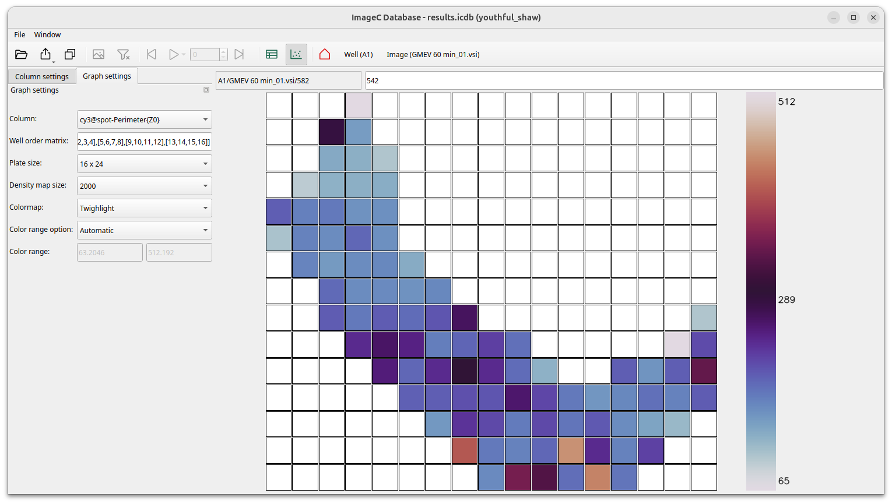

[](https://imagec.org/about_imagec)
[](https://imagec.org)
[](https://forum.image.sc/tag/imagec)

[](https://cppreference.com/)
[](https://github.com/joda01/imagec/stargazers)
[](https://github.com/joda01/imagec/forks)
[](https://github.com/joda01/imagec-stats)
[](https://github.com/joda01/imagec/releases)


# ImageC (EVAnalyzer 2)

is an open source application designed for high throughput analyzing of microscopy images in the biological sciences.  

With ImageC image processing pipelines can be defined which are applied on a set of images to analyze.
The resulting data is stored in a file-based database (duckdb) and can either be viewed directly in ImageC using the built-in reporting tool, or the data can be exported to other file formats.  

ImageC (EVAnalyzer 2), the direct successor of [EVAnalyzer](https://github.com/joda01/evanalyzer) an imageJ plugin with more than 3000 downloads (June 2024), is a standalone application written in C++.
The main goals were to improve performance, allow the processing of big tiffs and improve usability.

## Feature comparison

|                                                           |ImageC   |EVAnalyzer |
|-----------------------------------------------------------|-------  |-------    |
|[BioFormats support](https://github.com/ome/bioformats)    |x        |x          |
|[OME-XML support](https://docs.openmicroscopy.org/)        |x        |x          |
|XLSX report generation                                     |x        |x          |
|R report generation                                        |x        |-          |
|Max. image channels                                        |10       |5          |
|Max. Stainings                                             |50       |5          |
|Max image size                                             |no limit |2GB        |
|Max. number of pipelines                                   |32       |5          |
|Support for big tiff                                       |x        |-          |
|AI based object detection                                  |x        |-          |
|Database based result processing                           |x        |-          |
|Heatmap generation                                         |x        |-          |
|Image density map generation                               |x        |-          |
|In image object marker                                     |x        |-          |
|Built-in reporting tool                                    |x        |-          |
|Live preview and live edit mode                            |x        |-          |
|Individual pipeline generation                             |x        |-          |
|Video support                                              |x        |-          |

## Screenshots



-----

## Developers section

This section contains information needed for anyone who is interested and especially for those who would like to contribute.

### Database schema

All data generated during an analysis run are stored using the file based database duckdb.
Following database schema is used:


The data generated for each detected ROI are stored in the `objects` table.


#### Image ID coding

The `object.image_id` identifies an image unique per run.
This id is calculated by the `fnv1a` hash: `object.image_id = fnv1a(<ORIGINAL-IMAGE-PATH>)`

## Debugging

 valgrind --tool=massif --log-file="filename" ./build/build/tests "[pipeline_test_spots]"
 valgrind --gen-suppressions=all --tool=massif --log-file="filename" ./build/build/tests "[pipeline_test_nucleus]"

#### Debug UI in docker

Instal
```
apt-get install -y xserver-xorg xinit libxcb-cursor-dev libxcb-*
```
and execute 
```
xhost +local:docker
```
on your host machine

#### Show console output in Windows

Use Windows powershell and execute imagec with:
```
Start-Process -RedirectStandardOutput out.txt imagec.exe
```

#### Create dependency graph

```
conan graph info . --profile conan/profile_linux --format=html > graph.html
```

#### Suppress JNI segfault in gdb

JNI generates some internal false positive segfaults which can be supressed for debugging.

Execute one of the two following lines in `gdb`
```
handle SIGSEGV nostop noprint pass

or

handle SIGSEGV nostop print pass
```


### Add new command

- Create new command in `backend/commands/image_functions`
- Add the new command to `backend/settings/pipeline/pipeline_step.hpp`
- Add the new command to `backend/settings/pipeline/pipeline_factory.hpp`
- Add the command tp `ui/container/dialog_command_selection.cpp`

## Build


### Deploy build docker image

docker build --target live -t joda001/imagec:live .
docker build --target build -t joda001/imagec:v1.7.x .
docker push  joda001/imagec:v1.7.x

### Build for Windows

#### Preparation

Add powershell permissions:

`set-executionpolicy remotesigned`

Install:

- Python3
- `pip install conan`

#### Compile

Execute `build_win.ps1` 


## Used open source libs

Many thank's to the authors of following open source libraries I used:

<!---EXT-LIBS-->
Title | Link | License
------|------|--------
qt/6.7.1|https://www.qt.io|LGPL-3.0-only
zlib/1.3.1|https://zlib.net|Zlib
openssl/3.4.1|https://github.com/openssl/openssl|Apache-2.0
pcre2/10.42|https://www.pcre.org/|BSD-3-Clause
bzip2/1.0.8|https://sourceware.org/bzip2|bzip2-1.0.8
double-conversion/3.3.0|https://github.com/google/double-conversion|BSD-3-Clause
freetype/2.13.2|https://www.freetype.org|FTL
libpng/1.6.44|http://www.libpng.org|libpng-2.0
brotli/1.1.0|https://github.com/google/brotli|['MIT']
fontconfig/2.15.0|https://gitlab.freedesktop.org/fontconfig/fontconfig|MIT
expat/2.6.3|https://github.com/libexpat/libexpat|MIT
icu/74.2|http://site.icu-project.org|Unicode-3.0
harfbuzz/8.3.0|https://harfbuzz.github.io/|MIT
xkbcommon/1.6.0|https://github.com/xkbcommon/libxkbcommon|MIT
xorg/system|https://www.x.org/wiki/|MIT
libxml2/2.13.4|https://gitlab.gnome.org/GNOME/libxml2/-/wikis/|MIT
libiconv/1.17|https://www.gnu.org/software/libiconv/|LGPL-2.1-or-later
wayland/1.22.0|https://wayland.freedesktop.org|MIT
libffi/3.4.4|https://sourceware.org/libffi/|MIT
opengl/system|https://www.opengl.org/|MIT
md4c/0.4.8|https://github.com/mity/md4c|MIT
opencv/4.10.0|https://opencv.org|Apache-2.0
eigen/3.4.0|http://eigen.tuxfamily.org|['MPL-2.0', 'LGPL-3.0-or-later']
protobuf/3.21.12|https://github.com/protocolbuffers/protobuf|BSD-3-Clause
ade/0.1.2d|https://github.com/opencv/ade|Apache-2.0
libjpeg/9e|http://ijg.org|IJG
openjpeg/2.5.2|https://github.com/uclouvain/openjpeg|BSD-2-Clause
libtiff/4.6.0|http://www.simplesystems.org/libtiff|libtiff
libdeflate/1.19|https://github.com/ebiggers/libdeflate|MIT
xz_utils/5.4.5|https://tukaani.org/xz|['Unlicense', 'LGPL-2.1-or-later', 'GPL-2.0-or-later', 'GPL-3.0-or-later']
jbig/20160605|https://github.com/ImageMagick/jbig|GPL-2.0
zstd/1.5.5|https://github.com/facebook/zstd|BSD-3-Clause
libwebp/1.3.2|https://chromium.googlesource.com/webm/libwebp|BSD-3-Clause
quirc/1.2|https://github.com/dlbeer/quirc|ISC
catch2/3.7.0|https://github.com/catchorg/Catch2|BSL-1.0
pugixml/1.14|https://pugixml.org/|MIT
nlohmann_json/3.11.3|https://github.com/nlohmann/json|MIT
libxlsxwriter/1.1.8|https://github.com/jmcnamara/libxlsxwriter|BSD-2-Clause
minizip/1.2.13|https://zlib.net|Zlib
duckdb/1.1.3|https://github.com/cwida/duckdb|MIT
cpp-httplib/0.19.0|https://github.com/yhirose/cpp-httplib|MIT
cli11/2.5.0|https://github.com/CLIUtils/CLI11|BSD-3-Clause
cereal/1.3.2|https://github.com/USCiLab/cereal|BSD-3-Clause
onnx/1.17.0|https://github.com/onnx/onnx|Apache-2.0
rapidyaml/0.7.1|https://github.com/biojppm/rapidyaml|['MIT']
c4core/0.2.0|https://github.com/biojppm/c4core|['MIT']
fast_float/6.1.0|https://github.com/fastfloat/fast_float|['Apache-2.0', 'MIT', 'BSL-1.0']
onnxruntime/1.18.1|https://onnxruntime.ai|MIT
abseil/20240116.1|https://github.com/abseil/abseil-cpp|Apache-2.0
date/3.0.1|https://github.com/HowardHinnant/date|MIT
libcurl/8.11.1|https://curl.se|curl
re2/20231101|https://github.com/google/re2|BSD-3-Clause
flatbuffers/23.5.26|http://google.github.io/flatbuffers|Apache-2.0
boost/1.86.0|https://www.boost.org|BSL-1.0
libbacktrace/cci.20240730|https://github.com/ianlancetaylor/libbacktrace|BSD-3-Clause
safeint/3.0.28|https://github.com/dcleblanc/SafeInt|MIT
ms-gsl/4.0.0|https://github.com/microsoft/GSL|MIT
cpuinfo/cci.20231129|https://github.com/pytorch/cpuinfo|BSD-2-Clause
nsync/1.26.0|https://github.com/google/nsync|Apache-2.0
mlpack/4.6.2|https://github.com/mlpack/mlpack|BSD-3-Clause
armadillo/12.6.4|http://arma.sourceforge.net|Apache-2.0
openblas/0.3.25|https://www.openblas.net|BSD-3-Clause
ensmallen/2.21.0|https://github.com/mlpack/ensmallen|BSD-3-Clause
stb/cci.20230920|https://github.com/nothings/stb|['Unlicense', 'MIT']
llvm-openmp/17.0.6|https://github.com/llvm/llvm-project/blob/main/openmp|Apache-2.0 WITH LLVM-exception
bshoshany-thread-pool/5.0.0|https://github.com/bshoshany/thread-pool|MIT
libtorch/2.9.0|None|BSD-3-Clause
tensorflow-lite/2.15.0|https://www.tensorflow.org/lite/guide|Apache-2.0
farmhash/cci.20190513|https://github.com/google/farmhash|MIT
fft/cci.20061228|http://www.kurims.kyoto-u.ac.jp/~ooura/fft.html|LicenseRef-LICENSE
gemmlowp/cci.20210928|https://github.com/google/gemmlowp|Apache-2.0
ruy/cci.20231129|https://github.com/google/ruy|Apache-2.0
intel-neon2sse/cci.20210225|https://github.com/intel/ARM_NEON_2_x86_SSE|BSD-2-Clause
xnnpack/cci.20240229|https://github.com/google/XNNPACK|BSD-3-Clause
fp16/cci.20210320|https://github.com/Maratyszcza/FP16|MIT
psimd/cci.20200517|https://github.com/Maratyszcza/psimd|MIT
pthreadpool/cci.20231129|https://github.com/Maratyszcza/pthreadpool|BSD-2-Clause
fxdiv/cci.20200417|https://github.com/Maratyszcza/FXdiv|MIT

<!---EXT-LIBS-->

Thank's to the authors of [imagej](https://github.com/imagej/imagej2) I ported some image processing algorithms from to C++.  
ImageC is the follower of [evanalyzer](https://github.com/joda01/evanalyzer).


## For MacOS you have to do

chmod +x imagec.app/Contents/MacOS/imagec
xattr -dr com.apple.quarantine imagec.app
open imagec.app

---

## LICENSE

Copyright 2019-2025 Joachim Danmayr  

Most parts of this software are licensed for **non-commercial** use only.
Educational, research, and personal use are permitted.
For **Commercial** please contact the copyright owner.

Some parts are licensed under **AGPL-3.0**.
